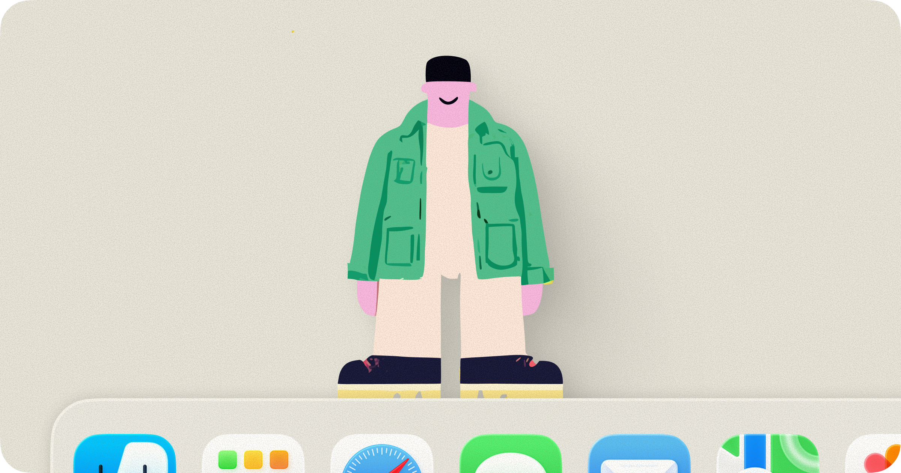

# lil agents



Tiny AI companions that live on your desktop and walk back and forth while you work. Click one to open an AI terminal. They walk, they think, they vibe.

Supports **Claude Code**, **OpenAI Codex**, and **GitHub Copilot** CLIs — switch between them from the menu.

---

## platforms

| Platform | Status | Implementation |
|---|---|---|
| **macOS** (Sonoma 14.0+) | Full support | Native Swift/AppKit app, dock-integrated |
| **Linux** | Supported | Python/GTK3 app, walks above the taskbar |

---

## features

- Animated characters (Bruce and Jazz) walk back and forth above your dock/taskbar
- Click a character to chat with an AI in a themed popover
- Switch between Claude, Codex, and Copilot from the menu
- Four visual themes: Peach, Midnight, Cloud, Moss
- Thinking bubbles with playful phrases while your agent works
- Transparent character windows (compositor required on Linux)

---

## macOS

### requirements

- macOS Sonoma (14.0+)
- At least one supported CLI installed:
  - [Claude Code](https://claude.ai/download): `curl -fsSL https://claude.ai/install.sh | sh`
  - [OpenAI Codex](https://github.com/openai/codex): `npm install -g @openai/codex`
  - [GitHub Copilot](https://github.com/github/copilot-cli): `brew install copilot-cli`

### building

Open `lil-agents.xcodeproj` in Xcode and hit Run.

### privacy

lil agents runs entirely on your Mac and sends no personal data anywhere.

- **Your data stays local.** The app plays bundled animations and calculates your dock size to position the characters. No project data, file paths, or personal information is collected or transmitted.
- **AI providers.** Conversations are handled entirely by the CLI process you choose (Claude, Codex, or Copilot) running locally. lil agents does not intercept, store, or transmit your chat content. Any data sent to the provider is governed by their respective terms and privacy policies.
- **No accounts.** No login, no user database, no analytics in the app.
- **Updates.** lil agents uses Sparkle to check for updates, which sends your app version and macOS version. Nothing else.

---

## Linux

The Linux version is a Python/GTK3 application in the [`linux/`](linux/) directory. Characters walk above your taskbar using a transparent overlay window.

### requirements

- Python 3.8+
- GTK3 + PyGObject (`python3-gi`, `python3-gi-cairo`)
- A compositor (picom, kwin, mutter, etc.) for transparent windows
- At least one supported CLI installed:
  - **Claude Code**: `curl -fsSL https://claude.ai/install.sh | sh`
  - **OpenAI Codex**: `npm install -g @openai/codex`
  - **GitHub Copilot CLI**: `npm install -g @github/copilot-cli`

### installing dependencies

Run the setup script (detects apt, dnf, pacman, zypper automatically):

```bash
cd linux
bash setup.sh
```

Or install manually for your distro:

**Debian / Ubuntu / Linux Mint**
```bash
sudo apt install python3-gi python3-gi-cairo gir1.2-gtk-3.0
# Optional — for system tray support:
sudo apt install gir1.2-appindicator3-0.1
# or on newer Ubuntu:
sudo apt install gir1.2-ayatanaappindicator3-0.1
```

**Fedora / RHEL**
```bash
sudo dnf install python3-gobject python3-cairo gtk3 libappindicator-gtk3
```

**Arch / Manjaro**
```bash
sudo pacman -S python-gobject python-cairo gtk3 libappindicator-gtk3
```

**openSUSE**
```bash
sudo zypper install python3-gobject python3-cairo typelib-1_0-Gtk-3_0
```

### running

```bash
cd linux
python3 lil_agents.py
```

### installing CLIs on Linux

**Claude Code**
```bash
curl -fsSL https://claude.ai/install.sh | sh
```

**OpenAI Codex**
```bash
npm install -g @openai/codex
# Requires Node.js — install via nvm or your distro's package manager
```

**GitHub Copilot CLI**
```bash
# Option 1: npm
npm install -g @github/copilot-cli

# Option 2: via the gh CLI extension
sudo apt install gh          # or: sudo dnf install gh
gh extension install github/gh-copilot
```

### notes

- Transparent windows require a running compositor. On bare X11 without one, characters will have an opaque background. On GNOME, KDE Plasma, and most modern desktops this works out of the box.
- The system tray icon uses AppIndicator3 when available; otherwise falls back to GtkStatusIcon (which may appear differently depending on your desktop environment).
- Characters walk above the workarea boundary reported by your window manager, which is usually directly above the taskbar.

---

## license

MIT License. See [LICENSE](LICENSE) for details.
